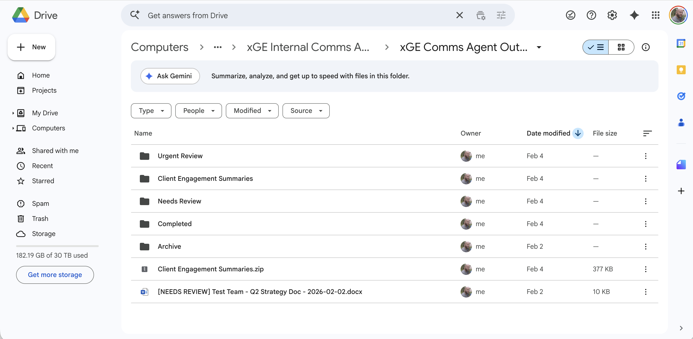
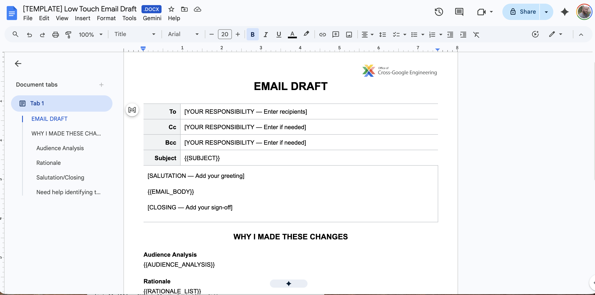
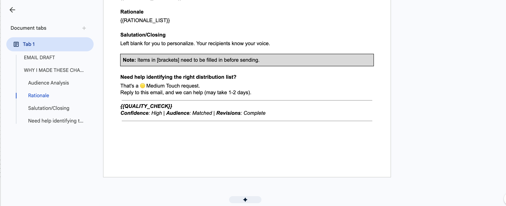

# Comms Triage Agent

Autonomous triage, revision, and escalation for a high-volume internal communications intake queue. Built on Google Apps Script + Gemini with a three-prompt architecture.

**Live in production. ~160 hours/year saved** in manual triage and drafting.

## In 60 seconds

- **What it does:** A Google Form submits comms requests → Apps Script routes each to a Gemini prompt → output lands in a Google Doc with Chat/email notifications.
- **Architecture:** Three prompts (triage, revise, escalate) over a dynamic KB (core + conditional living documents + per-stakeholder profiles).
- **Impact:** ~160 hours/year saved in a production comms queue.
- **Read next:** [architecture](ARCHITECTURE.md) · [source walkthrough](src/README.md) · [prompts](prompts/).

## What it looks like

The agent writes its output into a Drive folder structure organized by routing decision — `Completed` for autonomously-handled Low touch, `Urgent Review` and `Needs Review` for escalations, and `Client Engagement Summaries` for audience context.



## What it does

A communications team receives requests through an intake form — most are drafts that need polish, some need a senior reviewer. The agent:

1. **Triages** each request into Low / Medium / High touch based on complexity, audience, and stakes, with a confidence score attached.
2. **Revises** Low-touch drafts autonomously — reads the submitter's draft, loads the relevant knowledge base, rewrites against a style framework, explains each change, and delivers via Google Doc + email notification.
3. **Escalates** Medium/High-touch requests by generating a structured briefing document so a human reviewer starts from context instead of a cold read. A VP-involvement signal forces high-touch regardless of other factors.

## Why I built this

The intake queue was the bottleneck. Most requests were repetitive polish work; the fraction that needed judgment needed more context than a reviewer could assemble on demand. The agent handles the repetitive tier end-to-end and turns the judgment tier into a pre-briefed decision instead of a cold read.

## Architecture

**Three-prompt design:**

- **Triage prompt** — Classifies touch level with a confidence score. Includes explicit criteria for VP-involvement, site-related work, and change-management triggers.
- **Revision prompt** — Rewrites Low-touch drafts against a style framework (Smart Brevity), the relevant audience profile, and revision examples embedded in the prompt. Every change comes with a rationale.
- **Escalation prompt** — For Medium/High, generates a structured starter document that reads as a briefing, not a draft.

**Dynamic knowledge base:**

- **Core KB** (always loaded) — org background, audience profiles, triage criteria, style rules.
- **Living Documents** (conditionally loaded) — source-of-truth docs pulled in based on content triggers in the request. Change-management keywords → change-management strategy doc. Technical-recommendation keywords → technical roadmap playbook. Keeps the context window focused on what the request actually needs.
- **Engagement summaries** — per-stakeholder audience profiles loaded when a request names a known recipient.

**Data flow:**

```
Intake Form → Sheet → Apps Script trigger
           → Triage (classify + confidence)
           → KB loader (core + conditional living docs + engagement summaries)
           → Revision (Low) OR Escalation briefing (Medium/High)
           → Google Doc output + Gmail notification + Chat ping
```

Full system diagram: [`ARCHITECTURE.md`](ARCHITECTURE.md).

## What's implemented today

- End-to-end Low-touch revision flow: form → triage → dynamic KB load → revision → Google Doc + email
- Medium and High touch escalation flows with separate Doc templates per path
- VP auto-escalation override
- Google Chat webhook notifications per touch level
- Weekly Friday digest to Chat with volume, resolution-time, and time-saved stats
- Auto-generated metrics tab on the tracking spreadsheet
- Bypass-email monitoring (for requests that skip the form)
- End-to-end test functions covering Low, Medium, High, VP-involved, site-related, and draft-error paths

## Example: end-to-end run

**Form submission:**
- Requester: [Engineering Director]
- Request type: Email draft review
- Target audience: VP leadership
- Timeline: This week
- Attachment: draft Google Doc

**Triage output** (`TRIAGE_PROMPT`):

```json
{
  "touch_level": "High",
  "confidence": 0.91,
  "reasons": [
    "VP leadership audience triggers +1 level",
    "Draft review rather than new content request",
    "Timeline allows for full review"
  ],
  "route": "escalate"
}
```

**Escalation briefing** (`ESCALATION_PROMPT`, delivered to the escalation owner):

```
High-touch review landed.

Context: VP-facing email draft on [topic].
Stakes: Leadership visibility; first-draft feedback requested.
Suggested framing: [three framing options with tradeoffs]
Draft: [Google Doc link]
Tracking row: [spreadsheet link]
```

**Delivery:**
- Google Chat ping to the escalation owner
- Tracking row updated on the intake spreadsheet
- Requester notified: "Your request has been escalated for senior review."

The reviewer opens the Chat ping and starts from a briefing, not a cold read.

For Low touch requests, the revised draft lands in a structured Google Doc with a built-in rationale section:





## Stack

- **Google Apps Script** — runs inside the Workspace trust boundary with native access to Gmail, Sheets, Docs, Drive, and Chat (via webhook)
- **Gemini API** — triage, revision, and escalation generation
- **Structured markdown KB** — core context docs + a conditional living-documents loader keyed to request content

## Limitations

- **Not plug-and-play for a different org.** Knowledge base documents, audience profiles, and engagement summaries are org-specific and would need to be rewritten for a different context. The architecture, prompt design, and loader logic are the reusable parts.
- **Single-tenant by design.** All KB content lives in one Drive folder tree; no multi-org isolation.
- **Human-in-loop for Medium/High.** Escalations produce a briefing, not a final draft — a reviewer still writes the response.
- **No automated eval harness.** Output quality is monitored qualitatively via the Friday digest and spot-checks; no per-run scoring yet.

## Results / impact

- **~160 hours/year saved** in manual triage and drafting. Methodology: prior-quarter median handling time per touch level × current monthly request volume, extrapolated annually. Baseline and volume are tracked on the metrics tab; the figure updates as volume shifts.
- **Low-touch requests** resolve in minutes instead of a same-day turnaround.
- **Medium/High escalations** arrive as pre-briefed decisions, not cold reads.
- **Friday digest** gives the team ongoing visibility into volume, resolution time, and time-savings trends.

## Run it yourself

Setup is documented in [`src/README.md`](src/README.md):

1. Create an Apps Script project
2. Paste `src/comms-agent.gs` into the editor
3. Configure required Script Properties (Gemini API key, Sheet ID, Drive folder IDs, Chat webhook, etc.)
4. Wire three triggers: form-submit, hourly bypass check, weekly Friday digest
5. Set OAuth scopes (Sheets, Drive, Docs, Gmail send, external request)

Full property list, optional Living Document properties, and OAuth scope details are in `src/README.md`.

## What's not in this repo

- Actual knowledge base content — org-specific docs, audience profiles, and engagement summaries are org-confidential and replaced with placeholders
- Internal URLs, names, and API credentials — see `src/README.md` for the placeholder inventory
- Historical tracking spreadsheet and metrics data

## Further reading

- [`ARCHITECTURE.md`](ARCHITECTURE.md) — system diagram and data flow
- [`DEPLOYMENT.md`](DEPLOYMENT.md), [`INTEGRATION.md`](INTEGRATION.md), [`TESTING.md`](TESTING.md) — operational guides
- [`src/README.md`](src/README.md) — source walkthrough and setup
- [`prompts/`](prompts/) — triage, revision, and escalation prompts
- [`docs/knowledge-base/`](docs/knowledge-base/) — KB framework
- [`docs/engagement-summaries/engagement-summary-template.md`](docs/engagement-summaries/engagement-summary-template.md) — per-stakeholder profile format
